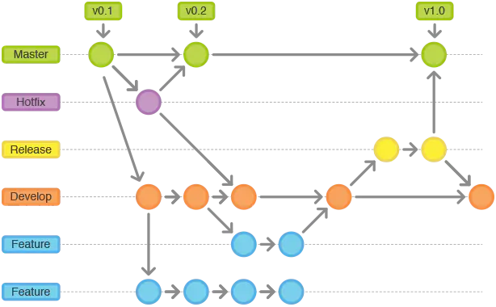

# git-manage 
git 管理规范

## git commit 提交类型规范
Git Commit Guidelines中推荐的type类型如下：
* feat: 新增功能fix: 修复bug
* docs: 仅文档更改
* style: 不影响代码含义的更改（空白、格式设置、缺失 分号等）
* refactor: 既不修复bug也不添加特性的代码更改
* perf: 改进性能的代码更改
* test: 添加缺少的测试或更正现有测试
* chore: 对构建过程或辅助工具和库（如文档）的更改
* delete：删除功能或文件
* modify：修改功能
* build：改变构建流程，新增依赖库、工具等（例如webpack、gulp、npm修改）
* test：测试用例的新增、修改
* ci：自动化流程配置修改
* revert：回滚到上一个版本

## git 分支管理

master分支是生产环境的最新代码，在这个分支上不能直接修改，都是从测试分支合并过来，并打上tag。

hotfix分支是基于生产环境产生dug而新建的分支, 当bug修改完成之后，要合并代码到master、develop和release 分支，并删除分支。

release分支是测试分支，当开发完成之后，把develop分支的代码合并到release分支，测试出bug，新建需改bug的分支，改完之后要合并到develop和release分支。

develop分支，是开发代码最新的分支，当功能分支feature、fixbug等分支修改完成之后，都要合并到develop分支上面，之后再到realease测试分支。

feature分支是开发新功能的分支。

分支命名最好以人名+分支类型来进行命名，这样可以确定责任人，方便排查原因。

